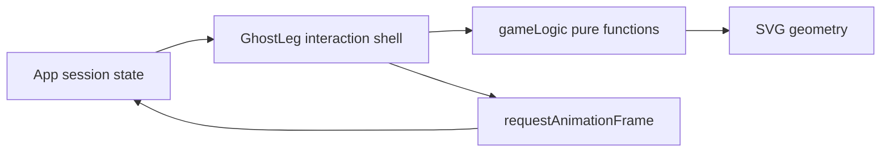

# Architecture Spine — Footprint

## Design Paradigm

採 **Functional Core / Imperative Shell**：梯線產生、衝突判斷與路徑計算屬無副作用核心；React 元件是協調表單、SVG、動畫與無障礙回饋的外殼。



## Invariants & Rules

### AD-1 — [ADOPTED] 遊戲規則保持純函式

- **Binds:** CAP-1、CAP-2、CAP-3
- **Prevents:** 不同畫面各自實作橋線衝突或路徑規則，產生不一致結果。
- **Rule:** 隨機梯線、橋線合法性與起點到終點路徑只能由 `gameLogic` 匯出的純函式計算；React 元件不得複製規則。

### AD-2 — 狀態所有權按生命週期切分

- **Binds:** CAP-1、CAP-2、CAP-3
- **Prevents:** 新局、重播或調整橫線時出現跨元件殘留狀態。
- **Rule:** `App` 擁有設定、玩家佇列、分配與最新結果；`GhostLeg` 只擁有自訂橫線、目前動畫與已完成路徑，並在 game data 改變時清除。

### AD-3 — 動畫序列化

- **Binds:** CAP-2
- **Prevents:** 多次快速點擊覆寫 active player，造成玩家與任務配對錯誤。
- **Rule:** 任一動畫進行時，未分配起點不得觸發新分配；結果只可由該動畫完成回呼提交。

### AD-4 — SVG 呈現與操作語意分離

- **Binds:** CAP-2、CAP-3
- **Prevents:** SVG 縮放後座標錯置，以及只能用滑鼠點擊的起點。
- **Rule:** 梯線幾何由 SVG 呈現；起點由 HTML button 提供鍵盤語意；指標新增橫線時須以 `getScreenCTM().inverse()` 或等價方式轉換至 viewBox 座標。

## Consistency Conventions

| Concern | Convention |
|---|---|
| 元件與檔案 | React 元件用 PascalCase；純邏輯用 camelCase named exports。 |
| 梯線資料 | 橫線固定為 `{ col, row }`，`col` 指左側欄，`row` 為 0–height 的邏輯座標。 |
| 玩家索引 | 起點、終點與玩家色一律使用 zero-based column index；UI 才顯示 one-based 編號。 |
| 狀態更新 | 不直接改陣列或物件；所有 React state 使用 immutable update。 |
| 動畫 | 只透過 `requestAnimationFrame`；unmount 或重播前取消前一 frame。 |
| 文案 | 使用繁體中文；結果格式固定為「{玩家} 抽到：{任務}」。 |

## Stack

| Name | Version |
|---|---|
| React | 19.2.0 |
| Vite | 7.2.4 |
| JavaScript | ECMAScript 2020+ |
| SVG | SVG 2 browser platform |
| Deployment | GitHub Pages via `gh-pages` 6.3.0 |

## Structural Seed

```text
src/
  App.jsx          # session、設定與表面切換
  GhostLeg.jsx     # 舞台互動與動畫外殼
  gameLogic.js     # 梯線純函式核心
  index.css        # token 與響應式視覺系統
```

部署環境只有瀏覽器與 GitHub Pages：Vite 產生 `dist/`，不呼叫遠端 API、不讀取 runtime secret。

## Capability → Architecture Map

| Capability / Area | Lives in | Governed by |
|---|---|---|
| CAP-1 設定與產生遊戲 | `App.jsx`, `gameLogic.js` | AD-1、AD-2 |
| CAP-2 選路、動畫、結果 | `App.jsx`, `GhostLeg.jsx`, `gameLogic.js` | AD-1、AD-2、AD-3、AD-4 |
| CAP-3 自訂橫線與新局 | `GhostLeg.jsx`, `App.jsx`, `gameLogic.js` | AD-1、AD-2、AD-4 |

## Deferred

- 自動化單元與瀏覽器測試框架：本次先保留可測純函式邊界，待需求確認後選型。
- 永久儲存、分享網址與多人同步：SPEC 明列非目標，若進入範圍需重新決定資料所有權。
- 把 `GhostLeg` 拆成更多視覺子元件：先以狀態與純函式邊界控制複雜度，避免為小型介面過度分層。
